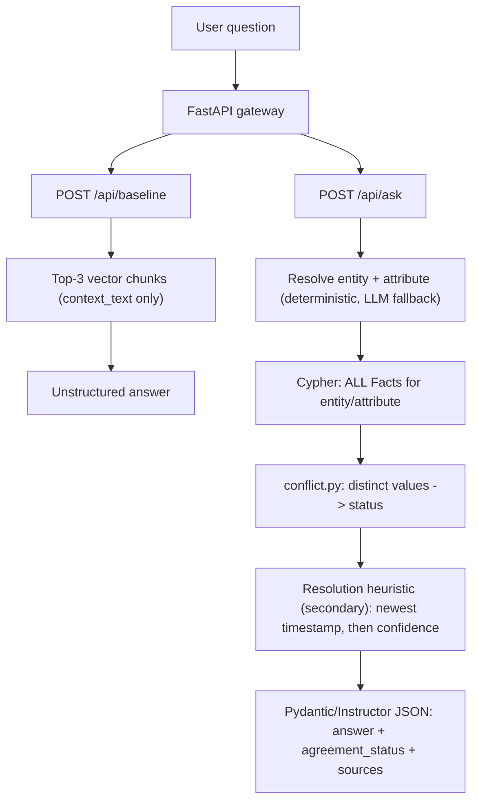

# Conflict-Aware Graph RAG (Neo4j + FastAPI)

Enterprise docs contradict each other ("timeout = 30s" in a 2022 runbook, "60s" in a 2024 ADR). Plain vector RAG
retrieves top-K chunks and **silently picks one**. This project models every statement as a first-class
`Fact` node with provenance (`value, source, timestamp, confidence`) so that **conflict detection is a structural
graph query + code, not something an LLM has to notice**. The LLM only *phrases* the answer.



## Graph schema
`(Entity {name})-[:HAS_ATTRIBUTE]->(Attribute {key, name, entity})-[:STATED_BY]->(Fact {id, value, source, timestamp, confidence, context_text})`

Design note: `Attribute` is keyed per entity (`entity::attribute`). Merging attributes on name alone would fuse
`api_timeout` across unrelated entities and manufacture false conflicts. Facts are `MERGE`d on a deterministic
hash, so re-ingesting is idempotent. All Cypher is parameterized (`app/utils/cypher_queries.py`).

## Run it
```bash
cp .env.example .env                       # optional: add a real OPENAI_API_KEY
python scripts/generate_dataset.py         # (already committed) -> data/dataset.json + dataset.json
docker-compose up -d --build
docker-compose ps                          # wait for neo4j + app = healthy
docker-compose exec app python scripts/ingest.py      # graph is also auto-ingested on first boot
docker-compose exec app python scripts/evaluate.py    # writes evaluation_results.json (+ results/evaluation_details.json)
docker-compose exec app pytest -q
```
Neo4j browser: http://localhost:7474 | API: http://localhost:8000/health | docs: http://localhost:8000/docs

```bash
curl -s localhost:8000/api/ask -H 'content-type: application/json' \
  -d '{"question":"What is the API timeout for the payments service?"}'
```
```json
{"answer":"Sources disagree: architecture-doc-v2.pdf (2023-01) states 30s; runbook-2024.md (2024-06) states 60s. By the resolution heuristic (most recent timestamp, confidence as tie-break), the most recent source runbook-2024.md (2024-06, confidence 0.9) suggests 60s, but this should be verified.",
 "agreement_status":"conflict",
 "sources":[{"value":"30s","source":"architecture-doc-v2.pdf","timestamp":"2023-01"},{"value":"60s","source":"runbook-2024.md","timestamp":"2024-06"}]}
```
Unknown entity (`"quantum flux capacity of the hyperdrive server"`) -> **404** with structured JSON, never a 500.

## Dataset (`python scripts/generate_dataset.py`)
Deterministic: 40 facts, 12 entities, **12 conflict groups**, 4 agree groups, 8 single-source facts.
Exact schema per item: `entity, attribute, value, source, timestamp, confidence, context_text`.

## Evaluation
19 questions: 10 conflict, 3 agree, 4 single-source, 2 unanswerable.
* `graph_rag_conflict_recall` = flagged conflicts / gold conflicts; `graph_rag_conflict_precision` = flagged / all flagged
  (agree, single, unanswerable questions count as false positives if flagged).
* `baseline_silent_pick_rate` = share of conflict questions where the baseline answer states exactly one of the
  conflicting values and uses no conflict language (deterministic judge `regex-v1`, pinned and logged).
* `results/evaluation_details.json` logs per-question intermediates, model IDs, `top_k`, judge version and dataset SHA-256.

Offline run (no API key): recall 1.0, precision 1.0, baseline silent-pick rate ~0.9–1.0. Rerun to regenerate - the numbers
in `evaluation_results.json` are the source of truth.

## Offline vs LLM mode
* **No `OPENAI_API_KEY`** (default): fully deterministic. Entity resolution = token matcher over the graph catalog;
  graph answers = templated text; baseline "generator" = extractive over the best-ranked chunk (mimics
  "highest-ranked chunk wins"). Zero network needed, fully reproducible.
* **With a key**: baseline uses a real LLM over top-3 chunks; graph answers are phrased via `instructor`
  (`GraphRagResponse`). Code **overrides** `agreement_status`/`sources` and rejects any LLM answer that doesn't state
  the conflict + heuristic and mention every value (falls back to the template). Entity resolution falls back to an LLM
  constrained to catalog entries.

## Requirement map
| Req | Where |
|---|---|
| Dataset | `scripts/generate_dataset.py` -> `data/dataset.json` |
| Compose + healthchecks | `docker-compose.yml`, `Dockerfile` |
| `POST /api/baseline` | `app/api/baseline_rag.py` |
| `POST /api/ask` | `app/api/graph_rag.py`, `app/utils/conflict.py` |
| Graph schema | `app/ingestion/graph_builder.py`, `scripts/ingest.py` |
| Evaluation | `scripts/evaluate.py` -> `evaluation_results.json` |
| `.env.example` | root |
| 404 handling | `app/main.py` |
| Resolution heuristic | `conflict.build_answer` / `rank_facts` |
| `GET /health` | `app/main.py` |
| Tests | `tests/` |

## Limitations
Deterministic resolver needs the question to name the entity/attribute tokens (an LLM/full-text fallback covers synonyms);
conflict = distinct normalized values, so "30s" vs "30 seconds" would count as a conflict (needs value canonicalization).

## youtude video
[click here](https://youtu.be/HwSZDCyI_r4)
